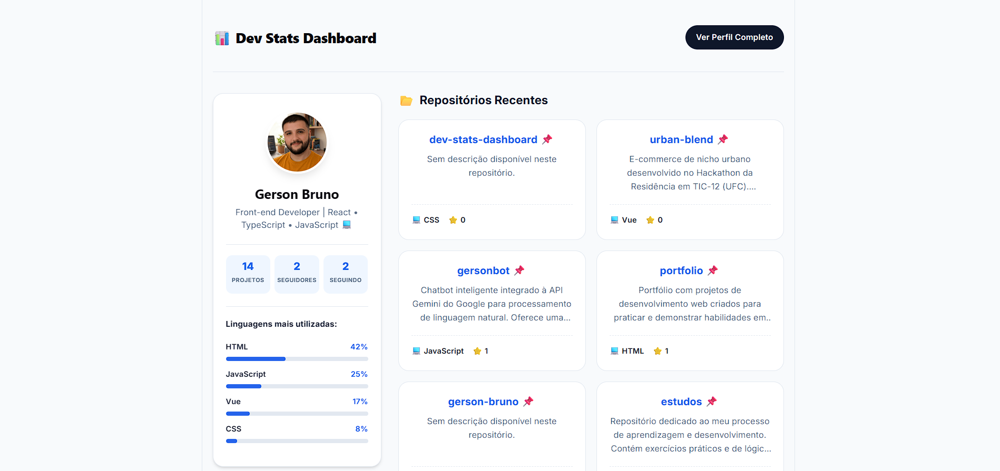

# 📊 Dev Stats Dashboard

## 🌟 Sobre o Projeto
O **Dev Stats Dashboard** é um dashboard interativo desenvolvido para o **GitHub Developer Program**. Ele consome a API oficial do GitHub para transformar dados brutos em uma interface visual limpa e informativa.

> **Status:** Projeto em desenvolvimento ativo para fins de estudo de integração de APIs e UX Design.

## 💻 Preview

## 🛠️ Funcionalidades
- [x] Integração com GitHub REST API via Octokit.
- [x] Busca dinâmica de perfis de usuário.
- [x] Visualização de Bio, Avatar e métricas (Repositórios, Seguidores).
- [x] Listagem de Repositórios em Cards (Próxima Sprint).
- [x] Skeleton Loading para melhor UX.

## 🎨 Design & UX
Como entusiasta de Design UI/UX, este projeto foca em:
- **Hierarquia Visual:** Informações cruciais em destaque.
- **Acessibilidade:** Uso de textos alternativos dinâmicos e contraste adequado.
- **Responsividade:** Planejado para funcionar em diferentes tamanhos de tela.

## 🚀 Como rodar localmente
1. Clone o repositório: `git clone https://github.com/gerson-bruno/dev-stats-dashboard.git`
2. Instale as dependências: `npm install`
3. Crie um arquivo `.env` com seu `VITE_GITHUB_TOKEN`.
4. Inicie o servidor: `npm run dev`
5. Acesse o dashboard em `http://localhost:5173/`

